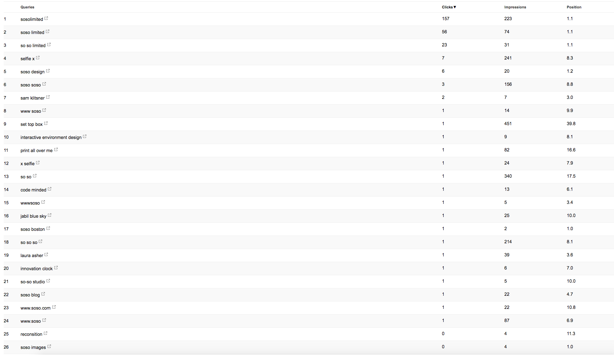
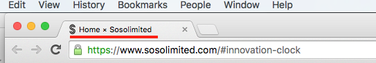
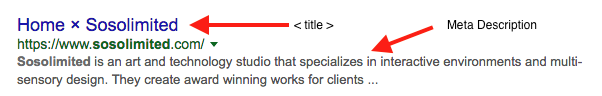
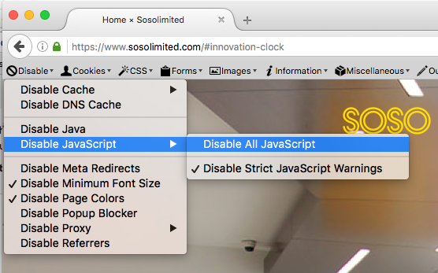
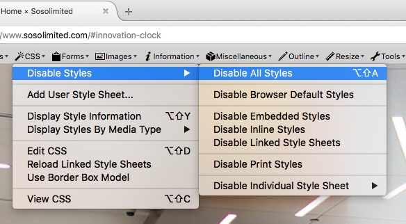
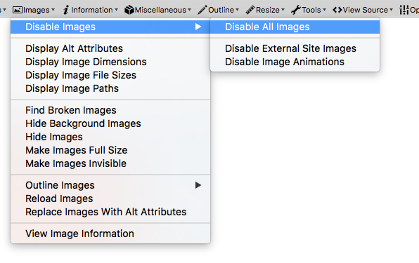
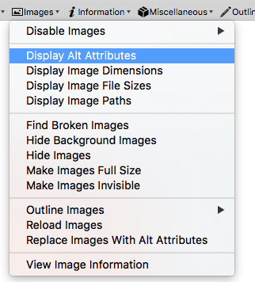

# SEO Fundamentals
> **Contents**  
> [About the Bots](#a-bit-about-bots)  
> [Search Engine Results Page](#search-engine-results-page-serp)  
> [Keyword Development](#keyword-development)  
> [On-page SEO](#on-page-seo)  
> [HTML Formatting](#html-formatting-for-seo) 
> [Be a Bot](#seeing-your-page-like-a-bot) 
> [Useful Tools](#useful-tools) 

Search Engine Optimization (SEO) is a process involving many different strategies in order to boost a website’s organic search standing. Regardless of the search engine, they all are working on indexing the internet, or gathering and prioritizing the information on every website to ensure when a user types something into the search bar the search engine will display the right results. 

 
 

## A Bit About Bots
Bots, otherwise known as crawlers are constantly scanning the web and following hyperlinks from webpage to webpage all for the sake of indexing. Without being indexed, your site can’t be found by any search engine.

There are two major categories of information these bots collect in order to understand what your website it about

1. The content on your site- both front and back end
2. Who is linking to your site (inbound links)

 
 

## Search Engine Results Page (SERP)
SEO really comes down to how easily people can find your page through searching, and a good way to measure how well your SEO efforts is by looking at the results page and where you fall in that sometimes endless list. There are a few main things that contribute to search positions

1. Your ranking for the searched keyword
2. Authority- determined by inbound links and where they are coming from (a link from NYT scores better than one from a small blogger) as well as age of the domain.
3. Relevance- this is more than just keyword usage, its about page structure, URL, headline keywords vs body keywords, etc.

 
 

## Keyword Development
Keywords are what potential visitors type into the search engine in order to find a webpage. Common practice in the SEO world is to focus on what’s called long tail keywords, or more specific searches. Although the overall search volume for these keywords is less, they generally have a higher click rate and connect you with the right customers. Think of the difference between some typing “design firms” and someone searching for “interactive design studio boston”, the first person is probably just browsing for top firms. The second person however is someone looking for a specific service in a specific space and is therefore more likely to click. 

To understand your current keyword breakdown, you can use Google’s Search Console tool to investigate what people are typing to get to your site. 

The first column is the keyword or phrase entered, followed by number of clicks for that term, number of Impressions (people who saw the link result but didnt click), and the average position on the SERP for that keyword search.

When developing a keyword strategy and library it’s good to start with “what’s missing” and thinking back to those long tailed keywords. Since we often work with clients locally, prioritizing “boston” and “san diego” would be a good starting point. After that, prioritize words that align with the overall strategy of the studio, terms like “interaction design” “data visualization” and so on. Building a library to include when writing copy will make this process easier and more consistent. 

 
 

## On-page SEO
Content is King, as long as that content is unique to the site and adding value. The same page repeated many times will actually lower your search engine ranking, however many pages all with unique content and specialized keywords will increase your ranking. 

**Homepage-** the perfect place to create an overall image of your company, think of someone searching for “design agency boston” as your target audience

**About page-** This is another great place to have general keywords

**Project pages-** Project-specific keywords from a predetermined library for example if our keyword library includes: interactive, lighting, code, installation, web design, sculpture, data  something like CSIS could have “csis is a lighting installation that uses live data” 

**Blog pages-** Should follow a similar keyword thread as the project pages!

 
 

## HTML formatting for SEO 

**URL structure**

Urls should be “human friendly” and readable. A URL like www.mysite.com/post68302 is not as informative as www.mysite.com/reclaimed-wood-DIY . The second URL is something that a potential visitor would type in a search bar, therefore making the page significantly more relevant. 

 

**Images**

Images are great for humans but bots need some extra information to understand what’s going on in the image, which comes from two main places:

1. The file name. Since the file name is in your `` tag, it’s read by crawlers. Much like with the URLs, it’s more valuable to have a filename like reclaimed-wood-table.jpg then img-56489.jpg.
2. The `<alt>` tag. The use of `<alt>` tags are important for a couple different situations
	- It gives the bots context to what’s in the image.
	- Similarly, alt tags give context to visually impaired by reading the description
	- Alt tags serve as a backup for when your image doesn’t load

Alt tags are a great place for keywords from your library, as long as they are used in context. Search engines are weary of keyword loading and this will negatively effect your page. 

 

**Title & Meta tags**

`<title>` tags have a few uses in how your page is displayed. On the SERP, the `<title>` is what generates the blue text leading each search result. On your webpage itself, it’s what shows up on the tab. 

There are two types of `<meta>` tags, Meta Description and Meta Keyword, all of which typically follow the `<title>` tag in your HTML. 

**Meta Description-** a **150 character** description of your site that will show up on the SERP and should include some general keywords.

**Meta Keywords** are a list of keywords in the HTML but are no longer considered by most search engines due to keyword stuffing.

 

`<title>` tag as a tab label

 

`<title>` and `<meta>` in action on the SERP

 

Meta Description in HTML

`<meta name ="description" content="Sosolimited is an art and technology studio with offices in Boston and San Diego">`

 

Meta Keywords in HTML

`<meta name= "keywords" content= "art, technology, design, Boston, San Diego">`

 

**Headline Tags**

Headline tags (h1, h2, h3...) tell the bots that the content between the tags is more important than the other stuff on the on the page and is treated accordingly, making them a great place to put natural keywords.

 

**Anchor Text**

When internally linking, using smart anchor text containing keywords about what the link is connected to is useful for crawlers (and readers) to understand what to expect from the page. 

 
 

##Seeing your page like a bot

The best way to understand what your page looks like to a search engine crawler is to visualize it for yourself. There are several tools out there, but for the image below I used these two firefox extensions:

[Web Developer](https://addons.mozilla.org/en-US/firefox/addon/web-developer/)

[User Agent Switcher](https://addons.mozilla.org/en-US/firefox/addon/user-agent-switcher/)

After loading the extensions above, navigate to your page and disable all JavaScript

 

Turn off all CSS

 

If there are images on the page, go ahead and hide these as well, but enable your `<alt>` tags

 

The page should looking something like this:

**Some things to check for in this view:**
- Is your nav system still linkable? Some more complicated navs may include dropdowns that search engine bots can’t follow.

- Where are your links? Generally, the higher up on a page the more important the link is to bots.

- Where are your keywords? The same principal follows for keywords as links.

- What is styled with headline tags? Since bots dont look at css, right now the most important thing on the page is the title “Innovation Clock” followed by “Architectural Data Visualization”. Despite this being the homepage, nothing that talks about the overall studio is prioritized in HTML.

- What are your Alt tags? Right now the tags are placeholders for what should be there, not descriptions of the image itself. This is an easy thing to fix and adds a lot of value to the site.

- Is your Anchor text adding value? 

Another method is to pull up the google cached version of your site by typing `http://webcache.googleusercontent.com/search?q=cache:<Your Website URL>`
Into your address bar. Alternatively, if you have chrome you can simply type `cache:<Website URL>` into the address bar, however if there is a redirect on your site this may not work. 

In this method, you can toggle different states as well as look at the source code to manually check things like `<meta>` and `<alt>` tags. 

 
 

##Useful Tools

Google Search Console- lets you evaluate keywords and how your site holds up in search. Formally Webmaster Tools

Google Analytics- In depth information on how people are moving through your site

[Google Page Analytics](https://chrome.google.com/webstore/detail/page-analytics-by-google/fnbdnhhicmebfgdgglcdacdapkcihcoh)- Live on-page data for web page clicks for chrome 

[MozBar](https://chrome.google.com/webstore/detail/mozbar/eakacpaijcpapndcfffdgphdiccmpknp?hl=en)- quick on page SEO ranking/evaluator plugin for chrome

